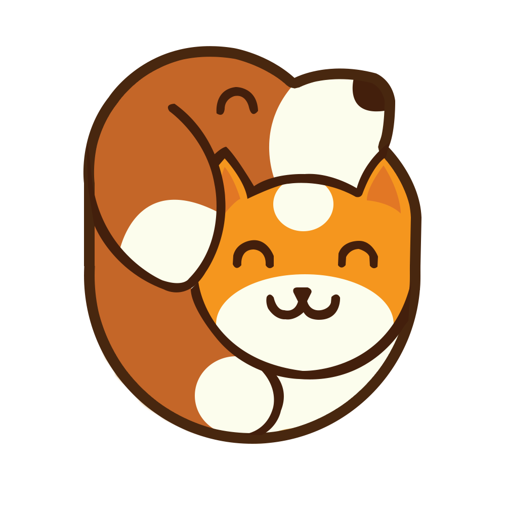
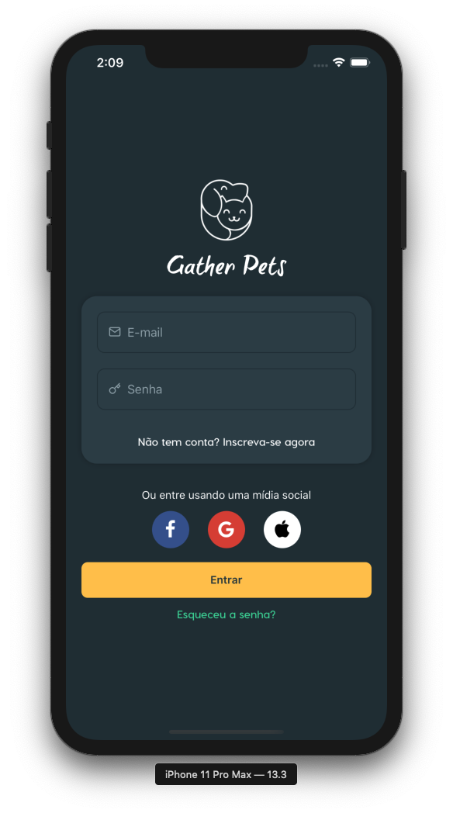
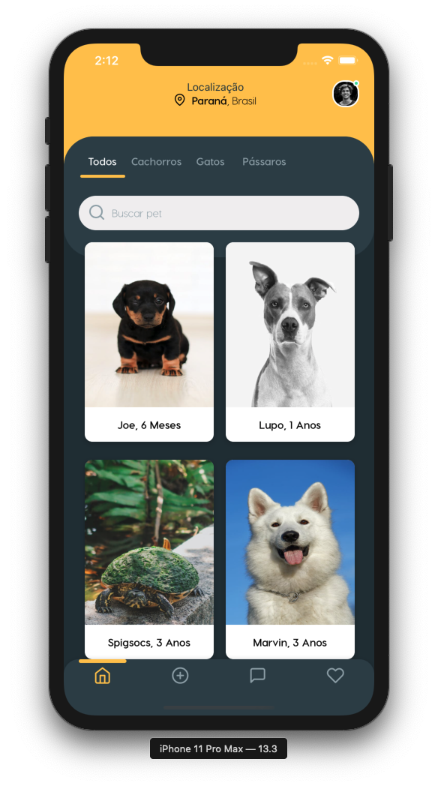
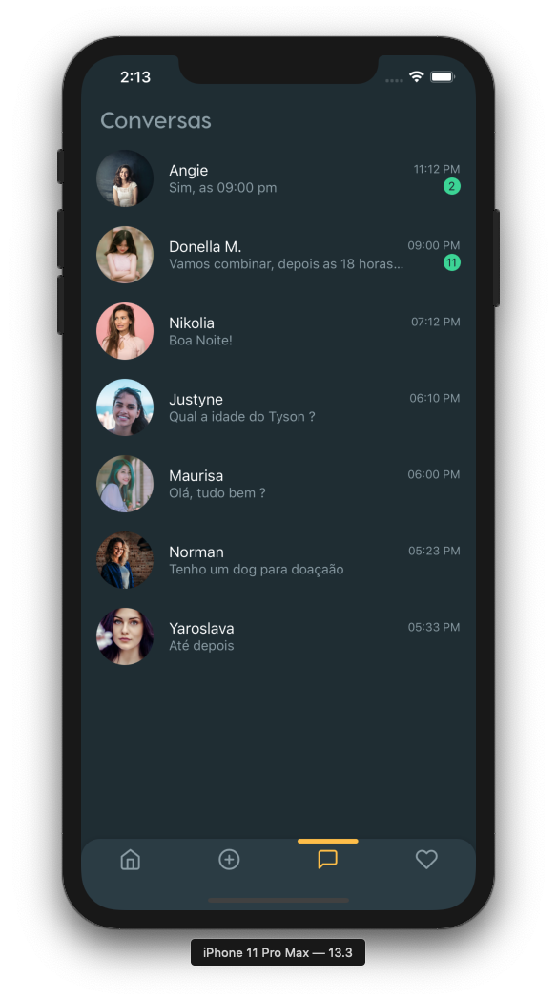
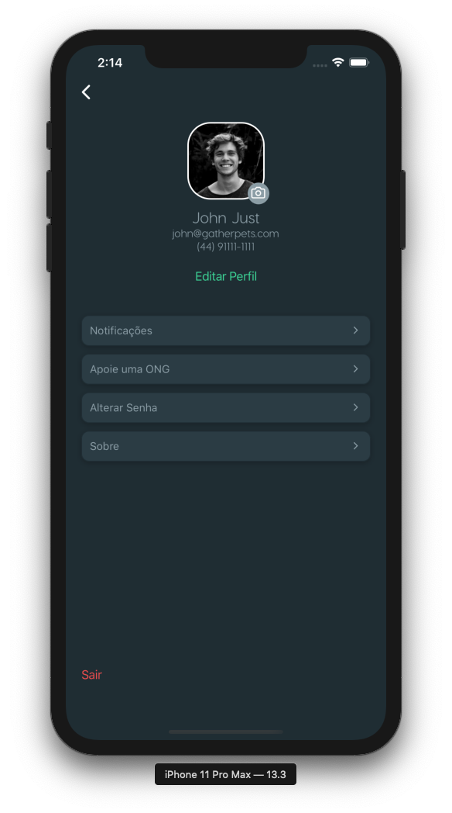

 

  

  
  
  
  
 

# Index

- [Index](#index)
    - [Description](#description)
  - [:dog: Start](#dog-start)
  - [:cat: Contribute](#cat-contribute)

---

### Description

Animal adoption app

## :dog: Start

- Clone repo: `git clone https://github.com/renankanu/gather-pets.git`
- Install dependencies: `yarn` or `npm install` 

---

## :cat: Contribute

- Create branch: `git checkout -b my-feature`
- Commit your changes: `git commit -m 'feat: Hello my feature '`
- Push: `git push origin my-feature`

---
